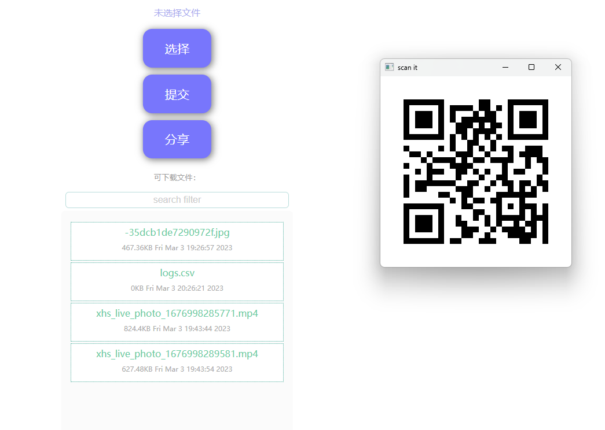
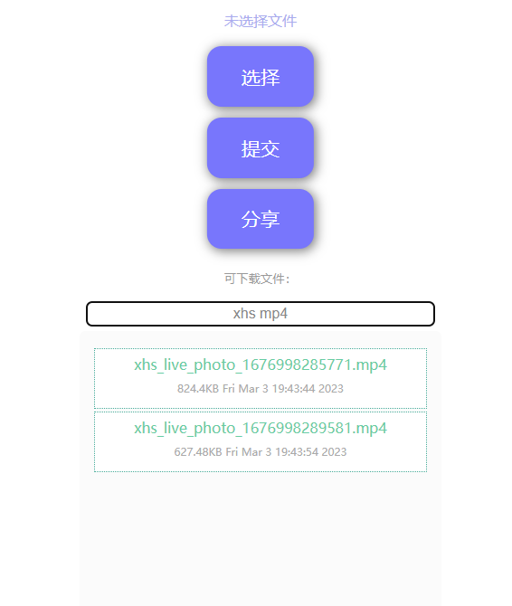

# Mobile-device-fast-transfer
Easy transf files from the mobile phone to the PC.

## Requirements
* Python3
* qrcode (installed by pip)
* opencv-python (installed by pip)

If you only need a server run in terminal, the Python3 is only required. 

## Usage
* Clone the repository.
* Change dir into the repository.
* Run `$ python server.py` in project folder.
* Scan the QR code in your PC screen.

`-v` is used to run a terminal only server: `$ python server.py -v`.

## Screenshots

